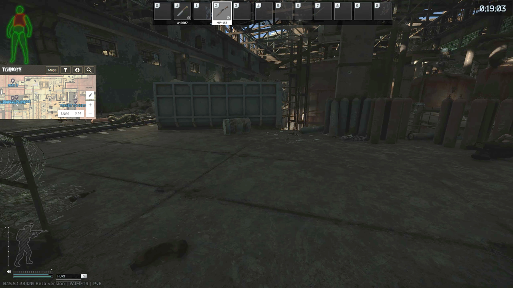
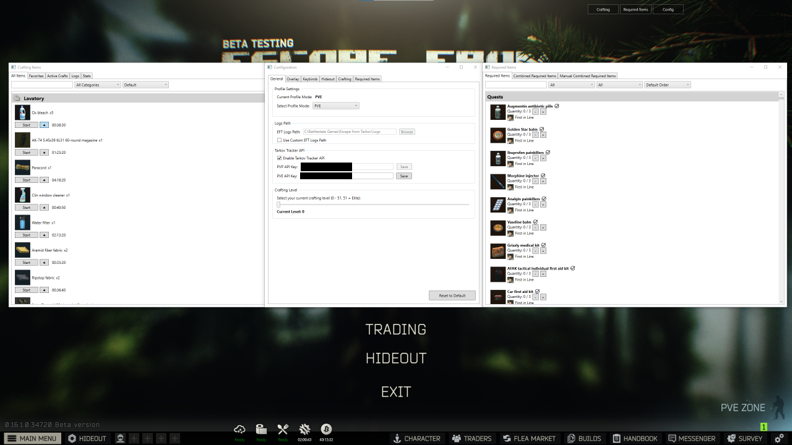
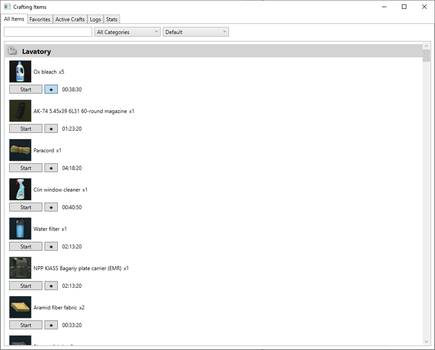
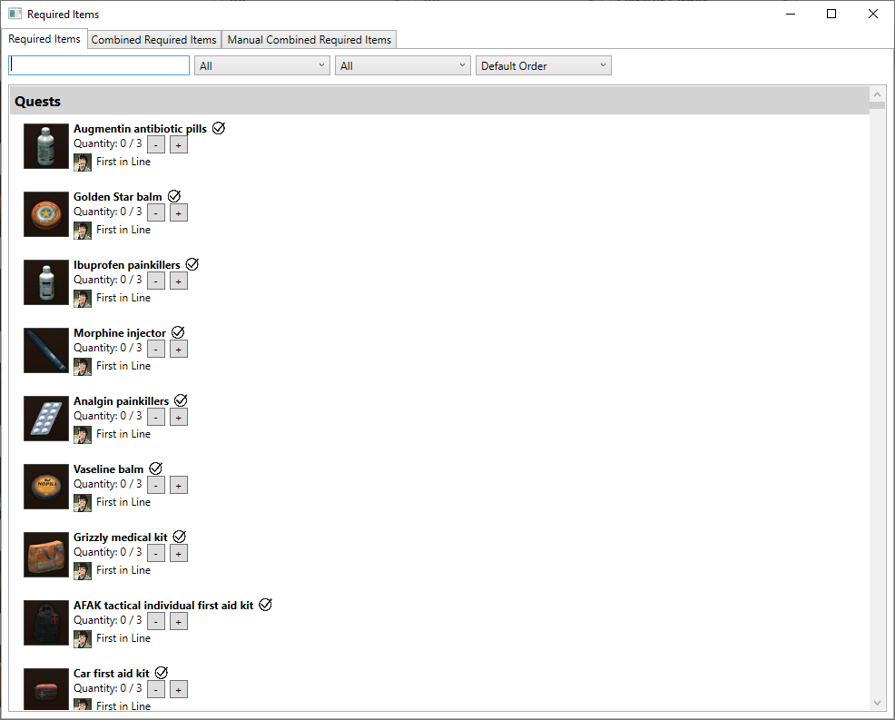
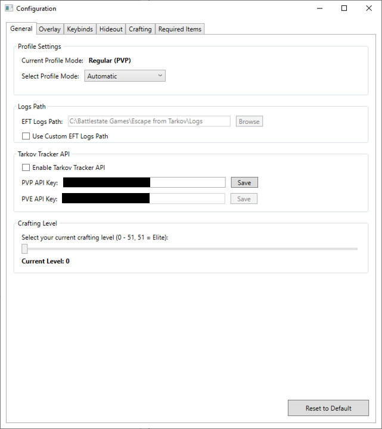

## Overview

This project is an application with an **overlay designed to support players in Escape From Tarkov**.

Development began with an analysis of key game mechanics characteristic of the genre, including:

- Game modes  
- Health system  
- Quests  
- Hideout  

This analysis helped identify issues affecting both **new and experienced players**.

## Research

The next step focused on reviewing **community-created tools** (websites and applications), evaluating:

- Their advantages  
- Their drawbacks  
- Missing features and gaps  

These insights guided the design of a new solution.

## Implementation

The application was developed using:

- **C#**
- **.NET 8**
- **WPF**
- **Tesseract OCR**
- **WebView2**

A key feature is an **overlay displayed directly on the game screen**, allowing players to access information without leaving the game.

## Features

The application provides:

- Tracking of items required for **quests** and **hideout development**
- **Crafting timers**
- A **minimap**
- An **in-game timer**

## Data Sources

Data used by the application comes from:

- The game's **log files**
- Public community APIs:
  - Tarkov.dev  
  - Tarkov Tracker  

Additionally, **OCR technology** is used to detect the remaining match time displayed on the screen.

## Development Process

The software development process included:

1. Problem analysis  
2. Functionality design  
3. Technology selection  
4. Implementation  
5. Testing  

The work also documented:

- Challenges encountered  
- Methods used to overcome them  
- Limitations of libraries and tools  
  - Tesseract (OCR constraints)  
  - Tarkov Tracker API limitations  

## Results

All project objectives were achieved.  
Long-term usage confirmed the **practical usefulness of the application** for Escape From Tarkov players.

Use of the application resulted in a **noticeable increase in gameplay efficiency**.

## Future Improvements

Possible future enhancements include:

- Integration with additional tools (e.g., **Rat Scanner**)  
- Further interface improvements  
- Expanded customization options  

## Screenshots

